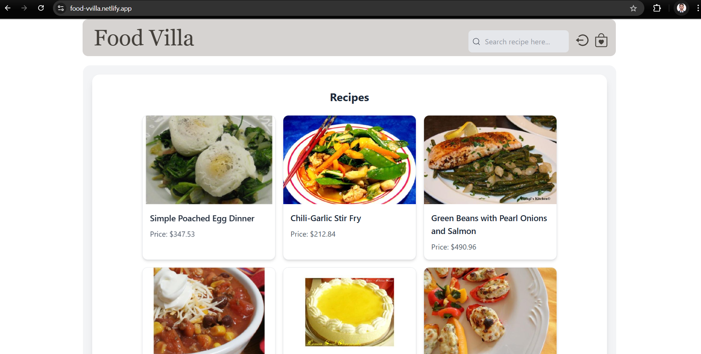
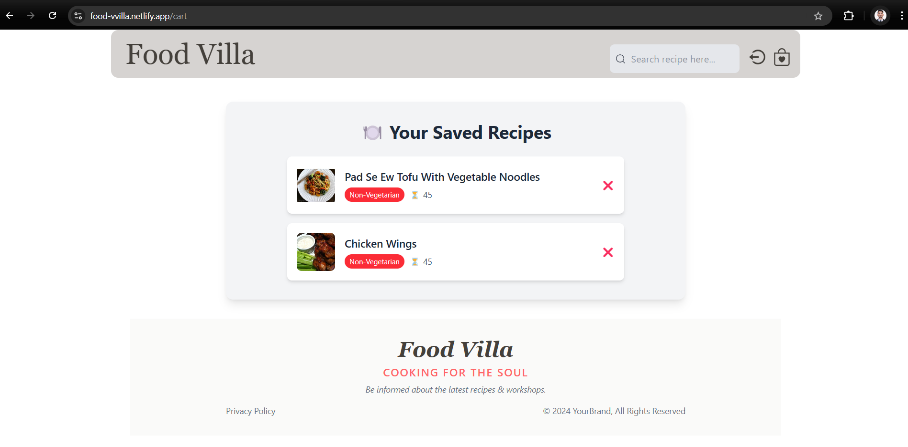

# Food-Villa

## Overview
Food-Villa is a web application that integrates modern frontend and backend technologies to deliver a seamless user experience. This project focuses on authentication, state management, and responsive design.

## Deployed Link
The application is live and can be accessed at: [Food-Villa Live](https://food-vvilla.netlify.app)

## Features

### Backend
- **OAuth Authentication**: Implemented using `passport-google-oauth20`.
- **Traditional Login**: Secure login with email and password.
- **JWT Authentication**: Stateless authentication using JSON Web Tokens.
- **Password Hashing**: Secured with `bcrypt`.

### Frontend
- **React**: Component-based UI development.
- **Tailwind CSS**: Utility-first CSS framework for responsive design.
- **Toaster**: Notifications for user feedback.
- **Axios**: HTTP client for API requests.
- **Context API**: State management for global application state.

## Screenshots

### Landing Page


### WishList


## Installation
1. Clone the repository:
  ```bash
  git clone https://github.com/Amarjeet5822/Food-Villa
  ```
2. Navigate to the project directory:
  ```bash
  cd Food-Villa
  ```
3. Install dependencies:
  ```bash
  npm install
  ```

## Usage
1. Start the development server:
  ```bash
  npm start
  ```
2. Open your browser and navigate to `http://localhost:3000`.

## Contributing
Contributions are welcome! Please fork the repository and submit a pull request.

## License
This project is licensed under the [MIT License](LICENSE).